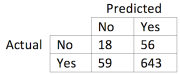

## Overview

1. About me  
2. Motivation  
3. Approach  
4. Results  
5. Future work  

## About me  

```{r echo=FALSE, message=FALSE, fig.width=10, fig.height=5}
library(png)
library(grid)
img <- readPNG("/Users/Walter/Desktop/New Rpres/Images/collage2.png")
 grid.raster(img)
```   

## About me

```{r echo=FALSE, message=FALSE, fig.width=10, fig.height=5}
library(png)
library(grid)
img <- readPNG("/Users/Walter/Desktop/New Rpres/Images/collage1.png")
 grid.raster(img)
```

## Instance selection for model-based classifiers
<div class="centered">
<div class="columns-2">
```{r echo=FALSE, message=FALSE, fig.width=2, fig.height=3}
library(png)
library(grid)
img <- readPNG("/Users/Walter/Desktop/New Rpres/Images/civilian.png")
 grid.raster(img)
```

```{r echo=FALSE, message=FALSE, fig.width=2, fig.height=3}
library(png)
library(grid)
img <- readPNG("/Users/Walter/Desktop/New Rpres/Images/soldier.png")
 grid.raster(img)
```
</div>

<br>
<font size="6"><b><div class="blue3">We can build a model to distinguish between these</div></b> </font>  
</div>
## Instance selection for model-based classifiers
<div class="centered">
```{r echo=FALSE, message=FALSE, fig.width=8.5, fig.height=5}
library(png)
library(grid)
img <- readPNG("/Users/Walter/Desktop/New Rpres/Images/classification_overview.png")
 grid.raster(img)
```
</div>
## Motivation

<font size="6"><b><div class="blue3">Accuracy counts</div></b> </font>  
- Prediction  
- Interpretation

## Motivation   
<font size="6"><b><div class="blue3">Aspects of a training dataset may make it difficult to build/induce/learn an accurate classifier</div></b> </font>

## Motivation

<div class="centered">
```{r, echo=FALSE, message=FALSE, warning=FALSE}
library(ggplot2)
library(xkcd)
data<-read.csv("/Users/Walter/Desktop/New Rpres/overlap.csv")

cbPalette <- c("#000000", "#FF0000", "#009E73", "#F0E442", "#0072B2", "#D55E00", "#CC79A7","#999999")
xrange <- range(data$X)
yrange <- range(data$Y)
set.seed(123)
ggplot(data,aes(x=data$X,y=data$Y))+
  geom_point(aes(colour=data$Group))+
  xkcdaxis(xrange,yrange)+
  ggtitle("Overlapping Classes")+
  scale_y_continuous(breaks=c(0,0.5,1), name="Y")+
  scale_x_continuous(breaks=c(0,0.5,1), name="X")+
  theme(legend.position="none", text = element_text(size = 16, family = "xkcd"))+
  scale_colour_manual(values=cbPalette)
  #geom_abline(intercept=-0.1, slope=1,size=2,lty='longdash',colour="#56B4E9")+
  #geom_abline(intercept=0.1, slope=1, size=2, lty='longdash',colour="#56B4E9")+
  #geom_abline(intercept=0, slope=1, size=2, lty='longdash', colour="#56B4E9")

```
</div>

Where should overlapping classes be separated?

## Motivation

<div class="centered">
```{r, echo=FALSE, message=FALSE, warning=FALSE}
set.seed(123)
ggplot(data,aes(x=data$X,y=data$Y))+
  geom_point(aes(colour=data$Group))+
  xkcdaxis(xrange,yrange)+
  ggtitle("Overlapping Classes")+
  scale_y_continuous(breaks=c(0,0.5,1), name="Y")+
  scale_x_continuous(breaks=c(0,0.5,1), name="X")+
  theme(legend.position="none", text = element_text(size = 16, family = "xkcd"))+
  scale_colour_manual(values=cbPalette)+
  geom_abline(intercept=-0.1, slope=1,size=2,lty='longdash',colour="#56B4E9")
  #geom_abline(intercept=0.1, slope=1, size=2, lty='longdash',colour="#56B4E9")+
  #geom_abline(intercept=0, slope=1, size=2, lty='longdash', colour="#56B4E9")
```
</div>

Where should overlapping classes be separated?

## Motivation

<div class="centered">
```{r, echo=FALSE, message=FALSE, warning=FALSE}
set.seed(123)
ggplot(data,aes(x=data$X,y=data$Y))+
  geom_point(aes(colour=data$Group))+
  xkcdaxis(xrange,yrange)+
  ggtitle("Overlapping Classes")+
  scale_y_continuous(breaks=c(0,0.5,1), name="Y")+
  scale_x_continuous(breaks=c(0,0.5,1), name="X")+
  theme(legend.position="none", text = element_text(size = 16, family = "xkcd"))+
  scale_colour_manual(values=cbPalette)+
  #geom_abline(intercept=-0.1, slope=1,size=2,lty='longdash',colour="#56B4E9")
  geom_abline(intercept=0.1, slope=1, size=2, lty='longdash',colour="#56B4E9")
  #geom_abline(intercept=0, slope=1, size=2, lty='longdash', colour="#56B4E9")
```
</div>

Where should overlapping classes be separated?

## Motivation

<div class="centered">
```{r, echo=FALSE, message=FALSE, warning=FALSE}
set.seed(123)
ggplot(data,aes(x=data$X,y=data$Y))+
  geom_point(aes(colour=data$Group))+
  xkcdaxis(xrange,yrange)+
  ggtitle("Overlapping Classes")+
  scale_y_continuous(breaks=c(0,0.5,1), name="Y")+
  scale_x_continuous(breaks=c(0,0.5,1), name="X")+
  theme(legend.position="none", text = element_text(size = 16, family = "xkcd"))+
  scale_colour_manual(values=cbPalette)+
  #geom_abline(intercept=-0.1, slope=1,size=2,lty='longdash',colour="#56B4E9")
  #geom_abline(intercept=0.1, slope=1, size=2, lty='longdash',colour="#56B4E9")
  geom_abline(intercept=0, slope=1, size=2, lty='longdash', colour="#56B4E9")
```
</div>

Where should overlapping classes be separated?

## Motivation
<div class="centered">
```{r, echo=FALSE, message=FALSE, warning=FALSE}
data2<-read.csv("/Users/Walter/Desktop/New Rpres/outlier.csv")
cbPalette <- c("#000000", "#FF0000", "#009E73", "#F0E442", "#0072B2", "#D55E00", "#CC79A7","#999999")
xrange <- range(data2$X)
yrange <- range(data2$Y)

set.seed(123)
ggplot(data2,aes(x=data2$X,y=data2$Y))+
  geom_point(aes(colour=data2$Group))+
  xkcdaxis(xrange,yrange)+
  ggtitle("Outliers")+
  scale_y_continuous(breaks=c(0,0.5,1), name="Y")+
  scale_x_continuous(breaks=c(0,0.5,1), name="X")+
  theme(legend.position="none",text = element_text(size = 16, family = "xkcd"))+
  scale_colour_manual(values=cbPalette)
```  
</div>  
Should these outliers be accommodated?  

## Motivation
<div class="centered">
```{r, echo=FALSE, message=FALSE, warning=FALSE}
data2<-read.csv("/Users/Walter/Desktop/New Rpres/outlier.csv")
cbPalette <- c("#000000", "#FF0000", "#009E73", "#F0E442", "#0072B2", "#D55E00", "#CC79A7","#999999")
xrange <- range(data2$X)
yrange <- range(data2$Y)

set.seed(123)
ggplot(data2,aes(x=data2$X,y=data2$Y))+
  geom_point(aes(colour=data2$Group))+
  xkcdaxis(xrange,yrange)+
  ggtitle("Outliers")+
  scale_y_continuous(breaks=c(0,0.5,1), name="Y")+
  scale_x_continuous(breaks=c(0,0.5,1), name="X")+
  theme(legend.position="none",text = element_text(size = 16, family = "xkcd"))+
  scale_colour_manual(values=cbPalette)+
  geom_segment(aes(x=0.05, y=-0.05, xend=0.475,yend=0.375),size=2,lty='longdash',colour="#56B4E9")+
  geom_segment(aes(x=0.475, y=0.375, xend=0.475,yend=0.20),size=2,lty='longdash',colour="#56B4E9")+
  geom_segment(aes(x=0.475, y=0.20, xend=0.545,yend=0.20),size=2,lty='longdash',colour="#56B4E9")+
  geom_segment(aes(x=0.545, y=0.25, xend=0.545,yend=0.425),size=2,lty='longdash',colour="#56B4E9")+
  geom_segment(aes(x=0.545, y=0.425, xend=1.05,yend=0.95),size=2,lty='longdash',colour="#56B4E9")

```
</div>  
Should these outliers be accommodated? 

## Motivation
<div class="centered">
```{r, echo=FALSE, message=FALSE, warning=FALSE}
data3<-read.csv("/Users/Walter/Desktop/New Rpres/minority.csv")
xrange <- range(data3$X)
yrange <- range(data3$Y)
cbPalette <- c("#000000", "#FF0000","#0072B2", "#6633CC", "#9933CC", "#F0E442", "#0072B2", "#D55E00", "#CC79A7","#999999")

set.seed(123)
ggplot(data3,aes(x=data3$X,y=data3$Y))+
  geom_point(aes(colour=data3$Group))+
  xkcdaxis(xrange,yrange)+
  ggtitle("Minority Class")+
  scale_y_continuous(breaks=c(0,0.5,1), name="Y")+
  scale_x_continuous(breaks=c(0,0.5,1), name="X")+
  theme(legend.position="none",text = element_text(size = 16, family = "xkcd"))+
  scale_colour_manual(values=cbPalette)+
  geom_abline(intercept=-0.1, slope=1, size=2, lty='longdash',colour="#56B4E9")
```
</div>

Does capturing the minority class sacrifice accuracy?  

## Motivation
<div class="centered">
```{r, echo=FALSE, message=FALSE, warning=FALSE}
data3<-read.csv("/Users/Walter/Desktop/New Rpres/minority.csv")
xrange <- range(data3$X)
yrange <- range(data3$Y)
cbPalette <- c("#000000", "#FF0000","#0072B2", "#6633CC", "#9933CC", "#F0E442", "#0072B2", "#D55E00", "#CC79A7","#999999")

set.seed(123)
ggplot(data3,aes(x=data3$X,y=data3$Y))+
  geom_point(aes(colour=data3$Group))+
  xkcdaxis(xrange,yrange)+
  ggtitle("Minority Class")+
  scale_y_continuous(breaks=c(0,0.5,1), name="Y")+
  scale_x_continuous(breaks=c(0,0.5,1), name="X")+
  theme(legend.position="none",text = element_text(size = 16, family = "xkcd"))+
  scale_colour_manual(values=cbPalette)+
  geom_abline(intercept=-0.1, slope=1, size=2, lty='longdash',colour="#56B4E9")+
  geom_segment(aes(x=0, y=0.8, xend=0.25,yend=0.8),size=2,lty='longdash',colour="#56B4E9")+
  geom_segment(aes(x=0, y=0.8, xend=0,yend=1),size=2,lty='longdash',colour="#56B4E9")+
  geom_segment(aes(x=0.25, y=0.8, xend=0.25,yend=1),size=2,lty='longdash',colour="#56B4E9")+
  geom_segment(aes(x=0, y=1, xend=0.25,yend=1),size=2,lty='longdash',colour="#56B4E9")
```
</div>

Does capturing the minority class sacrifice accuracy?  

## Motivation
<font size="6"><b><span class="blue3">We believe that selecting which instances to learn from can improve the accuracy of a classifier. <br><br> This is called </span><span class="black">***instance selection***</span><span class="blue3">!</span></b></font>

## Instance selection
<div class="centered">
```{r, echo=FALSE, message=FALSE, warning=FALSE, fig.width=10, fig.height=4.5}
library(ggplot2)
library(xkcd)
multiplot <- function(..., plotlist=NULL, file, cols=1, layout=NULL) {
  require(grid)
  
  # Make a list from the ... arguments and plotlist
  plots <- c(list(...), plotlist)
  
  numPlots = length(plots)
  
  # If layout is NULL, then use 'cols' to determine layout
  if (is.null(layout)) {
    # Make the panel
    # ncol: Number of columns of plots
    # nrow: Number of rows needed, calculated from # of cols
    layout <- matrix(seq(1, cols * ceiling(numPlots/cols)),
                     ncol = cols, nrow = ceiling(numPlots/cols))
  }
  
  if (numPlots==1) {
    print(plots[[1]])
    
  } else {
    # Set up the page
    grid.newpage()
    pushViewport(viewport(layout = grid.layout(nrow(layout), ncol(layout))))
    
    # Make each plot, in the correct location
    for (i in 1:numPlots) {
      # Get the i,j matrix positions of the regions that contain this subplot
      matchidx <- as.data.frame(which(layout == i, arr.ind = TRUE))
      
      print(plots[[i]], vp = viewport(layout.pos.row = matchidx$row,
                                      layout.pos.col = matchidx$col))
    }
  }
}
slope<-function(x1,y1,x2,y2)
{
  slope=(y1-y2)/(x1-x2)
  return(slope)
}
hyperplane<-function(x1,y1,x2,y2)
{
  mid<-midpoint(x1,y1,x2,y2)
  slope<--slope(x1,y1,x2,y2)
  intercept<-mid[2]-slope*mid[1]
  return(c(slope,intercept))
}
midpoint<-function(x1,y1,x2,y2)
{
  xnew=(x1+x2)/2
  ynew=(y1+y2)/2
  return(c(xnew,ynew))
}


#iris instance selection
all<-read.csv("/Users/Walter/Desktop/Prelim/iris/iris.csv")[,c(3,4,5)]
train<-all

levels(train$Class)<-c("setosa","versicolor","virginica")
levels(all$Class)<-c("setosa","versicolor","virginica")


best2<-c(18,109,122,76,9,63)
use<-all[best2,]

hyper1<-hyperplane(4.9,2,4.4,1.4)
hyper2<-hyperplane(4.0,1.0,1.4,0.3)


xrange <- range(all$Petal.Length)
yrange <- range(all$Petal.Width)

set.seed(123)
cbPalette <- c("#000000", "#E69F00", "#56B4E9", "#009E73", "#F0E442", "#0072B2", "#D55E00", "#CC79A7")
p2<-ggplot(all[best2,], aes(x=Petal.Length,y=Petal.Width))+
  geom_point(aes(shape=Class,color=Class))+
  xkcdaxis(xrange,yrange)+
  scale_y_continuous(limits=c(0,7.5),breaks=c(0,0.5,1,1.5,2,2.5))+
  scale_x_continuous(limits=c(0,7.5),breaks=c(0,2,4,6))+
  theme(text = element_text(size = 16, family = "xkcd"))+
  scale_colour_manual(values=cbPalette)+
  ggtitle("Iris\nAfter Instance Selection\n\n")+
  ylab("Petal Width")+
  xlab("Petal Length")

set.seed(123)
p1<-ggplot(all, aes(x=Petal.Length,y=Petal.Width))+
  geom_point(aes(shape=Class,color=Class))+
  xkcdaxis(xrange,yrange)+
  scale_y_continuous(limits=c(0,7.5),breaks=c(0,0.5,1,1.5,2,2.5))+
  scale_x_continuous(limits=c(0,7.5),breaks=c(0,2,4,6))+
  theme(text = element_text(size = 16, family = "xkcd"))+
  scale_colour_manual(values=cbPalette)+
  ggtitle("Iris\nBefore Instance Selection\n\n")+
  ylab("Petal Width")+
  xlab("Petal Length")

multiplot(p1,p2,cols=2)


```
</div>  
## Instance selection
<div class="centered">
```{r, echo=FALSE, message=FALSE, warning=FALSE, fig.width=10, fig.height=4.5}
library(ggplot2)
library(xkcd)
multiplot <- function(..., plotlist=NULL, file, cols=1, layout=NULL) {
  require(grid)
  
  # Make a list from the ... arguments and plotlist
  plots <- c(list(...), plotlist)
  
  numPlots = length(plots)
  
  # If layout is NULL, then use 'cols' to determine layout
  if (is.null(layout)) {
    # Make the panel
    # ncol: Number of columns of plots
    # nrow: Number of rows needed, calculated from # of cols
    layout <- matrix(seq(1, cols * ceiling(numPlots/cols)),
                     ncol = cols, nrow = ceiling(numPlots/cols))
  }
  
  if (numPlots==1) {
    print(plots[[1]])
    
  } else {
    # Set up the page
    grid.newpage()
    pushViewport(viewport(layout = grid.layout(nrow(layout), ncol(layout))))
    
    # Make each plot, in the correct location
    for (i in 1:numPlots) {
      # Get the i,j matrix positions of the regions that contain this subplot
      matchidx <- as.data.frame(which(layout == i, arr.ind = TRUE))
      
      print(plots[[i]], vp = viewport(layout.pos.row = matchidx$row,
                                      layout.pos.col = matchidx$col))
    }
  }
}
slope<-function(x1,y1,x2,y2)
{
  slope=(y1-y2)/(x1-x2)
  return(slope)
}
hyperplane<-function(x1,y1,x2,y2)
{
  mid<-midpoint(x1,y1,x2,y2)
  slope<--slope(x1,y1,x2,y2)
  intercept<-mid[2]-slope*mid[1]
  return(c(slope,intercept))
}
midpoint<-function(x1,y1,x2,y2)
{
  xnew=(x1+x2)/2
  ynew=(y1+y2)/2
  return(c(xnew,ynew))
}


#iris instance selection
all<-read.csv("/Users/Walter/Desktop/Prelim/iris/iris.csv")[,c(3,4,5)]
train<-all

levels(train$Class)<-c("setosa","versicolor","virginica")
levels(all$Class)<-c("setosa","versicolor","virginica")


best2<-c(18,109,122,76,9,63)
use<-all[best2,]

hyper1<-hyperplane(4.9,2,4.4,1.4)
hyper2<-hyperplane(4.0,1.0,1.4,0.3)


xrange <- range(all$Petal.Length)
yrange <- range(all$Petal.Width)

set.seed(123)
cbPalette <- c("#000000", "#E69F00", "#56B4E9", "#009E73", "#F0E442", "#0072B2", "#D55E00", "#CC79A7")
p2<-ggplot(all[best2,], aes(x=Petal.Length,y=Petal.Width))+
  geom_point(aes(shape=Class,color=Class))+
  xkcdaxis(xrange,yrange)+
  scale_y_continuous(limits=c(0,7.5),breaks=c(0,0.5,1,1.5,2,2.5))+
  scale_x_continuous(limits=c(0,7.5),breaks=c(0,2,4,6))+
  theme(text = element_text(size = 16, family = "xkcd"))+
  scale_colour_manual(values=cbPalette)+
  ggtitle("Iris\nAfter Instance Selection\n\n")+
  ylab("Petal Width")+
  xlab("Petal Length")+
  geom_abline(intercept=hyper1[2],slope=hyper1[1],linetype=1,colour="black")+
  geom_abline(intercept=hyper2[2],slope=hyper2[1],linetype=1,colour="black")

set.seed(123)
p1<-ggplot(all, aes(x=Petal.Length,y=Petal.Width))+
  geom_point(aes(shape=Class,color=Class))+
  xkcdaxis(xrange,yrange)+
  scale_y_continuous(limits=c(0,7.5),breaks=c(0,0.5,1,1.5,2,2.5))+
  scale_x_continuous(limits=c(0,7.5),breaks=c(0,2,4,6))+
  theme(text = element_text(size = 16, family = "xkcd"))+
  scale_colour_manual(values=cbPalette)+
  ggtitle("Iris\nBefore Instance Selection\n\n")+
  ylab("Petal Width")+
  xlab("Petal Length")

multiplot(p1,p2,cols=2)


```
</div>  
## Instance selection
<div class="centered">
```{r, echo=FALSE, message=FALSE, warning=FALSE, fig.width=10, fig.height=4.5}
library(ggplot2)
library(xkcd)
multiplot <- function(..., plotlist=NULL, file, cols=1, layout=NULL) {
  require(grid)
  
  # Make a list from the ... arguments and plotlist
  plots <- c(list(...), plotlist)
  
  numPlots = length(plots)
  
  # If layout is NULL, then use 'cols' to determine layout
  if (is.null(layout)) {
    # Make the panel
    # ncol: Number of columns of plots
    # nrow: Number of rows needed, calculated from # of cols
    layout <- matrix(seq(1, cols * ceiling(numPlots/cols)),
                     ncol = cols, nrow = ceiling(numPlots/cols))
  }
  
  if (numPlots==1) {
    print(plots[[1]])
    
  } else {
    # Set up the page
    grid.newpage()
    pushViewport(viewport(layout = grid.layout(nrow(layout), ncol(layout))))
    
    # Make each plot, in the correct location
    for (i in 1:numPlots) {
      # Get the i,j matrix positions of the regions that contain this subplot
      matchidx <- as.data.frame(which(layout == i, arr.ind = TRUE))
      
      print(plots[[i]], vp = viewport(layout.pos.row = matchidx$row,
                                      layout.pos.col = matchidx$col))
    }
  }
}
slope<-function(x1,y1,x2,y2)
{
  slope=(y1-y2)/(x1-x2)
  return(slope)
}
hyperplane<-function(x1,y1,x2,y2)
{
  mid<-midpoint(x1,y1,x2,y2)
  slope<--slope(x1,y1,x2,y2)
  intercept<-mid[2]-slope*mid[1]
  return(c(slope,intercept))
}
midpoint<-function(x1,y1,x2,y2)
{
  xnew=(x1+x2)/2
  ynew=(y1+y2)/2
  return(c(xnew,ynew))
}


#iris instance selection
all<-read.csv("/Users/Walter/Desktop/Prelim/iris/iris.csv")[,c(3,4,5)]
train<-all

levels(train$Class)<-c("setosa","versicolor","virginica")
levels(all$Class)<-c("setosa","versicolor","virginica")


best2<-c(18,109,122,76,9,63)
use<-all[best2,]

hyper1<-hyperplane(4.9,2,4.4,1.4)
hyper2<-hyperplane(4.0,1.0,1.4,0.3)


xrange <- range(all$Petal.Length)
yrange <- range(all$Petal.Width)

set.seed(123)
cbPalette <- c("#000000", "#E69F00", "#56B4E9", "#009E73", "#F0E442", "#0072B2", "#D55E00", "#CC79A7")
p2<-ggplot(all[best2,], aes(x=Petal.Length,y=Petal.Width))+
  geom_point(aes(shape=Class,color=Class))+
  xkcdaxis(xrange,yrange)+
  scale_y_continuous(limits=c(0,7.5),breaks=c(0,0.5,1,1.5,2,2.5))+
  scale_x_continuous(limits=c(0,7.5),breaks=c(0,2,4,6))+
  theme(text = element_text(size = 16, family = "xkcd"))+
  scale_colour_manual(values=cbPalette)+
  ggtitle("Iris\nAfter Instance Selection\n\n")+
  ylab("Petal Width")+
  xlab("Petal Length")+
  geom_abline(intercept=hyper1[2],slope=hyper1[1],linetype=1,colour="black")+
  geom_abline(intercept=hyper2[2],slope=hyper2[1],linetype=1,colour="black")

set.seed(123)
p1<-ggplot(all, aes(x=Petal.Length,y=Petal.Width))+
  geom_point(aes(shape=Class,color=Class))+
  xkcdaxis(xrange,yrange)+
  scale_y_continuous(limits=c(0,7.5),breaks=c(0,0.5,1,1.5,2,2.5))+
  scale_x_continuous(limits=c(0,7.5),breaks=c(0,2,4,6))+
  theme(text = element_text(size = 16, family = "xkcd"))+
  scale_colour_manual(values=cbPalette)+
  ggtitle("Iris\nBefore Instance Selection\n\n")+
  ylab("Petal Width")+
  xlab("Petal Length")+
  geom_abline(intercept=hyper1[2],slope=hyper1[1],linetype=1,colour="black")+
  geom_abline(intercept=hyper2[2],slope=hyper2[1],linetype=1,colour="black")

multiplot(p1,p2,cols=2)


```
</div>

## Instance selection  
```{r echo=FALSE, message=FALSE, fig.width=10, fig.height=4.5}
library(png)
library(grid)
img <- readPNG("/Users/Walter/Desktop/New Rpres/Images/explain4.png")
 grid.raster(img)
```

## Previous work
<font size="6"><b><span class="blue3">
${\mathbf {Max} \ \ \ \ Classifier \ Accuracy \\ \mathbf {s.t}  \\ \ \ \ \ \ \ \ \ \ \ \ \ \ x_i \in \{0,1\} \ \forall \ i \in I}$  </font></b></span>  
<br>  
- This is a combinatorial optimization problem  
- There are $2^n$ possible solutions   
- There is no closed form for the objective function

## Previous work

- A <font size="6"><b><span class="blue3"> VAST </font></b></span> majority rely on evolutionary algorithms to find a solution    

- Other optimization problems look similar to instance selection if <font size="6"><b><span class="blue3"> the problem is reformulated </font></b></span>.  This allows us to <font size="6"><b><span class="blue3"> take advantage of optimization theory </font></b></span>.  

## Experimental results 

```{r echo=FALSE, message=FALSE, warning=FALSE, fig.width=10, fig.height=4.5}
library(ggplot2)
library(reshape)
cbPalette <- c("#E69F00", "#56B4E9", "#009E73", "#F0E442", "#0072B2", "#D55E00", "#CC79A7")
sig<-function(datasets, a, b)
{
  #determine if a-b is different from 0
  #datasets<-results$Dataset
  #a<-results$NB.Test
  #b<-results$NB_IS.Test
  
  work<-data.frame(datasets, a, b)
  
  work$Difference<-"What?"
  
  here<-numeric(length=length(unique(work$datasets)))
  
  
  s1<-1
  while(s1<=length(here))
  {
    if(t.test(work$a[which(work$datasets==unique(work$datasets)[s1])],
              work$b[which(work$datasets==unique(work$datasets)[s1])],
              paired=TRUE)$p.value <= 0.05 )
    {
      work$Difference[which(work$datasets==as.character(unique(work$datasets)[s1]))]<-"Significant"
    }else
    {
      work$Difference[which(work$datasets==as.character(unique(work$datasets)[s1]))]<-"Not Significant"
    }
    
    s1<-s1+1
  }
  
  return(work$Difference)
  
}
multiplot <- function(..., plotlist=NULL, file, cols=1, layout=NULL) {
  require(grid)
  
  # Make a list from the ... arguments and plotlist
  plots <- c(list(...), plotlist)
  
  numPlots = length(plots)
  
  # If layout is NULL, then use 'cols' to determine layout
  if (is.null(layout)) {
    # Make the panel
    # ncol: Number of columns of plots
    # nrow: Number of rows needed, calculated from # of cols
    layout <- matrix(seq(1, cols * ceiling(numPlots/cols)),
                     ncol = cols, nrow = ceiling(numPlots/cols))
  }
  
  if (numPlots==1) {
    print(plots[[1]])
    
  } else {
    # Set up the page
    grid.newpage()
    pushViewport(viewport(layout = grid.layout(nrow(layout), ncol(layout))))
    
    # Make each plot, in the correct location
    for (i in 1:numPlots) {
      # Get the i,j matrix positions of the regions that contain this subplot
      matchidx <- as.data.frame(which(layout == i, arr.ind = TRUE))
      
      print(plots[[i]], vp = viewport(layout.pos.row = matchidx$row,
                                      layout.pos.col = matchidx$col))
    }
  }
}


median_sep<-function(diff, top)
{
  unique<-unique(diff$Combo)
  med<-array(0, dim=length(unique))
  
  s1<-1
  while(s1<=length(unique))
  {
    med[s1]=median(diff$value[which(diff$Combo==unique[s1])])
    s1<-s1+1
  }
  here<-sort(med, decreasing=TRUE, index.return=TRUE)$ix[1:top]
  toreturn<-unique[here]
  
  return(toreturn)
  
  
  
}


results<-read.csv("/Users/Walter/Experiments Spring 2014/data/results_inter.csv")
results$Dataset<-revalue(results$Dataset, c("balance"="Balance", "credit"="Credit",
                                            "diabetes"="Diabetes", "diamond"="Diamond",
                                            "ecoli"="Ecoli", "glass"="Glass",
                                            "horse"="Horse", "ionosphere"="Ionosphere",
                                            "landsat"="Landsat",
                                            "spect"="Spect", "tic-tac-toe"="Tic-tac-toe",
                                            "waveform"="Waveform", 
                                            "wisconsin_breast_cancer"="Cancer"))
results<-results[which(results$Dataset!="Landsat"), ]
results$NB_sig<-sig(results$Dataset, results$NB.Test, results$NB_IS.Test)
results$LR_sig<-sig(results$Dataset, results$LR.Test, results$LR_IS.Test)
results$DT_sig<-sig(results$Dataset, results$DT.Test, results$DT_IS.Test)


diff<-data.frame(row.names=c(1:dim(results)[1]))
diff$Dataset<-results[,1]
diff$NB<-results[,4]-results[,6]
diff$LR<-results[,10]-results[,12]
diff$DT<-results[,16]-results[,18]
diff$NB<- (-diff$NB)
diff$LR<- (-diff$LR)
diff$DT<- (-diff$DT)

diff<-melt(diff, id.vars=c("Dataset"))
diff$Combo<-paste(diff$Dataset, diff$variable, sep=" | ")
diff<-diff[,c(4,3)]

sig<-data.frame(results$Dataset,results$NB_sig, results$LR_sig, results$DT_sig)
sig<-melt(sig, id.vars="results.Dataset")

diff$sig<-sig$value

top<-median_sep(diff, 19)
diff1<-diff[which(diff$Combo %in% top),]
diff2<-diff[which(!diff$Combo %in% top),]

p1<-ggplot(diff1, aes(y=value,  x=reorder(factor(Combo), -value, FUN=median), fill=sig))+
  geom_hline(aes(yintercept=0), linetype='dashed', colour='red')+
  geom_boxplot()+
  xlab("")+
  scale_y_continuous(limits=c(-11.5, 31.5))+
  ylab("Difference in Test Accuracy")+
  ggtitle("Difference in Test Accuracy \nBefore and After Instance Selection")+
  coord_flip()+
  scale_fill_manual(values=cbPalette, breaks=c("Significant", "Not Significant"), name="Paired T-test")+
  theme_bw()+
  theme(axis.text.y=element_text(face="bold"), legend.position="none")

p2<-ggplot(diff2, aes(y=value,  x=reorder(factor(Combo), -value, FUN=median), fill=sig))+
  geom_hline(aes(yintercept=0), linetype='dashed', colour='red')+
  geom_boxplot()+
  xlab("")+
  scale_y_continuous(limits=c(-11.5, 31.5))+
  ylab("Difference in Test Accuracy")+
  ggtitle("Difference in Test Accuracy \nBefore and After Instance Selection")+
  coord_flip()+
  scale_fill_manual(values=cbPalette, breaks=c("Significant", "Not Significant"), name="Paired T-test")+
  theme_bw()+
  theme(axis.text.y=element_text(face="bold"),  legend.position="none")

  multiplot(p2,p1, cols=2)

```


## Landsat dataset  

- <font size="6"><b><span class="blue3">Classify land cover from satellite images</font></b></span>
- <font size="6"><b><span class="blue3">Logistic regression improved from 65% to 80%</font></b></span>

## Landsat dataset {.flexbox .vcenter}

```{r echo=FALSE, message=FALSE, fig.width=11, fig.height=4.5}
multiplot <- function(..., plotlist=NULL, file, cols=1, layout=NULL) {
  require(grid)
  
  # Make a list from the ... arguments and plotlist
  plots <- c(list(...), plotlist)
  
  numPlots = length(plots)
  
  # If layout is NULL, then use 'cols' to determine layout
  if (is.null(layout)) {
    # Make the panel
    # ncol: Number of columns of plots
    # nrow: Number of rows needed, calculated from # of cols
    layout <- matrix(seq(1, cols * ceiling(numPlots/cols)),
                     ncol = cols, nrow = ceiling(numPlots/cols))
  }
  
  if (numPlots==1) {
    print(plots[[1]])
    
  } else {
    # Set up the page
    grid.newpage()
    pushViewport(viewport(layout = grid.layout(nrow(layout), ncol(layout))))
    
    # Make each plot, in the correct location
    for (i in 1:numPlots) {
      # Get the i,j matrix positions of the regions that contain this subplot
      matchidx <- as.data.frame(which(layout == i, arr.ind = TRUE))
      
      print(plots[[i]], vp = viewport(layout.pos.row = matchidx$row,
                                      layout.pos.col = matchidx$col))
    }
  }
}
library(RWeka)
library(gdata)
train<-read.arff("/Users/Walter/Desktop/Disertation/visualize/landsat_pca/train.arff")
train$Class<-revalue(train$Class, c("1"="Red Soil", "2"="Cotton Crop",
                                            "3"="Grey Soil", "4"="Damp Grey Soil",
                                            "5"="Vegetation Stubble", "7"="Very Damp Grey Soil"))

train$Class<-factor(train$Class, levels=c("Red Soil", "Cotton Crop", "Vegetation Stubble","Grey Soil", "Damp Grey Soil","Very Damp Grey Soil"))

last<-dim(train)[2]
data_scale<-as.data.frame(scale(train[,-last]))
pca<-princomp(data_scale)
pca<-as.data.frame(pca$scores)
pca$Class<-train$Class


min_x<-min(pca$Comp.1)
max_x<-max(pca$Comp.1)
min_y<-min(pca$Comp.2)
max_y<-max(pca$Comp.2)

selected<-c(173,125,19,82,45,
            102,280,62,149,228,
            196,53,207,107,234,
            277,191,97,134,18,
            189,153,33,1,194,229,
            127,165,32,132,288,7,
            241)

p1<-ggplot(pca,aes(x=Comp.1,y=Comp.2,))+
  geom_point(aes(shape=Class,color=Class),size=3)+
  scale_colour_manual(values=c("#D55E00","#E69F00","#0072B2","#009E73", "#56B4E9", "#CC79A7"))+
  scale_shape_manual(values=c(19,2,5,0,4,8))+
  scale_x_continuous(limits=c(min_x, max_x))+
  scale_y_continuous(limits=c(min_y,max_y))+
  ylab("Principal Component 2")+
  xlab("Principal Component 1")+
  ggtitle("Original Training Dataset\nViewed With PCA")+
  theme_bw()

p2<-ggplot(pca[selected,],aes(x=Comp.1,y=Comp.2,))+
  geom_point(aes(shape=Class,color=Class),size=3)+
  scale_colour_manual(values=c("#D55E00","#E69F00","#0072B2","#009E73", "#CC79A7","#56B4E9"))+
  scale_shape_manual(values=c(19,2,5,0,8,4))+
  scale_x_continuous(limits=c(min_x, max_x))+
  scale_y_continuous(limits=c(min_y,max_y))+
  ylab("Principal Component 2")+
  xlab("Principal Component 1")+
  ggtitle("Selected Training Dataset\nViewed With PCA")+
  theme_bw()
multiplot(p1, p2, cols=2)
```

## Landsat dataset
<font size="6"><b><span class="blue3">Number of test instances misclassified:</font></b></span>

|                         | Damp Grey Soil | Total |
|-------------------------|----------------|-------|
| Original Training Data  | 9              | 51    |
| With Instance Selection | 14             | 28    |

<br>
<br>
The ability to classify the "Damp Grey Soil" is likely sacrificed in an effort to make it easier to separate the remaining classes

## Case study  

<font size="6"><b><span class="blue3"> A Population-based Assessment of Perioperative Mortality After Nephroureterectomy for Upper-tract Urothelial Carcinoma </font></b></span>

(I'll be calling this NU for UTUC!!)

## Case study
<div class="centered">
```{r echo=FALSE, message=FALSE}
library(png)
library(grid)
img <- readPNG("/Users/Walter/Desktop/New Rpres/Images/nephro.png")
 grid.raster(img)
```
</div>

## Case study  

Data: SEER database 
<br>  
Attributes: age, gender, histopathology, extraglandular<br>
&nbsp;&nbsp;&nbsp;&nbsp;&nbsp;&nbsp;&nbsp;&nbsp;&nbsp;&nbsp;&nbsp;&nbsp;&nbsp;&nbsp;&nbsp;&nbsp;&nbsp;&nbsp;&nbsp;&nbsp; involvement, tumor grade, tumor size, and<br>
&nbsp;&nbsp;&nbsp;&nbsp;&nbsp;&nbsp;&nbsp;&nbsp;&nbsp;&nbsp;&nbsp;&nbsp;&nbsp;&nbsp;&nbsp;&nbsp;&nbsp;&nbsp;&nbsp;&nbsp; mortality
<br>  
Patients: 2,328 (9% mortality)
<br>  
Classification task: predict mortality
<br>  
Classifier: logistic regression


## Case study
<div class="columns-2">
<div class="centered"><font size="6"><b><span class="blue3">Before</font></b></span></div>
<br>
  
<br>
-  90% test accuracy  
-  Uninformative!  
<div class="centered"><font size="6"><b><span class="blue3">After</font></b></span></div>
<br>
  
<br>
-  88% test accuracy  
-  Learn something about mortality  
</div>

## Case study
<div class="columns-2">
<div class="centered"><font size="6"><b><span class="blue3">Before</font></b></span></div>
<br>
  
<br>
-  90% test accuracy  
-  Uninformative!  
<div class="centered"><font size="6"><b><span class="blue3">After</font></b></span></div>
<br>
  
<br>
-  88% test accuracy  
-  Learn something about mortality  
</div>

## Future work 

*  <font size="6"><b><span class="blue3"> Find Air Force specific applications </font></b></span>  
*  <font size="6"><b><span class="blue3">Address overfitting</font></b></span>
*  <font size="6"><b><span class="blue3">Scale for large datasets  </font></b></span>
*  <font size="6"><b><span class="blue3">Optimize for imbalanced data  </font></b></span>  
    + Over/under sampling  
    + Cost sensitive learning
    
---  

Walter Bennette  
330-4957  
walter.bennette.1@us.af.mil


## Previous work {.smaller}

C. Reeves, S. Taylor, Selection of training sets for neural networks by a genetic algorithm, Parallel Problem Solving from Nature- PSSN V, (1998) 633-642.  <br>    
C. Reeves, D Bush, Using genetic algorithms for training data selection in RBF networks, in: Instance Selection and Construction for Data Mining, H. Liu and H. Motoda (Eds), Kluwer, Norwell, MA, (2001) pp.339–356.  <br>  
T. Endou, Q. Zhao, Generation of Comprehensible Decision Trees Through Evolution of Training Data, in proceedings of the 2002 Congress on Evolutionary Computation, (2002) 1221-1225.  <br>    
J. Cano, F. Herrera, M. Lozano, Using Evolutionary Algorithms as Instance Selection for Data Reduction in KDD: An Experimental Study, IEEE Transactions on Evolutionary Computation, 7(6) (2003) 561-575.  <br>  
J. Cano, F. Herrera, M. Lozano, Evolutionary Stratified Training Set Selection for Extracting Classification Rules with Trade off Precision-Interpretability, Data & Knowledge Engineering, 60 (2006) 90-108.  <br>    
N. Garcia-Pedrajas, Evolutionary computation for training set selection, WIREs Data Mining and Knowledge Discovery, 1 (2011) 512-523.  <br>  
Kim K-J, Artificial neural networks with evolutionary instance selection for financial forecasting, Expert Syst Appl, 30 (2006) 519-526.   <br>  

## Previous work {.smaller}
Wu, Shuing. Optimal instance selection for improved decision tree. (2007 Dissertation)    <br>  
Walter Bennette, Instance selection for simplified decision trees through the generation and selection of instance candidate subsets. (2009 Master’s thesis)  <br>  
Walter Bennette, Sigurdur Olafsson, Model based classifier improvement through the generation and selection of instance candidate subsets, Data and Knowledge Engineering (under revision).


--- 

```{r echo=FALSE, message=FALSE, fig.width=10, fig.height=6}
# Some graphic to show the comparison of IS to other methods
library(ggplot2)
library(RWeka)
library(plyr)
library(reshape)
prepare<-function()
{
results<-read.csv("/Users/Walter/Experiments Spring 2014/data/results_inter.csv")
results<-melt(results)


IS<-results[which(results$variable=="NB_IS.Test" | 
                  results$variable=="LR_IS.Test" |
                  results$variable=="DT_IS.Test" |
                  results$variable=="SVM.Test"|
                  results$variable=="RF.Test"|
                  results$variable=="Ada.Test"),]

levels(IS$variable)[levels(IS$variable)=="NB_IS.Test"] <- "NB w/ IS"
levels(IS$variable)[levels(IS$variable)=="LR_IS.Test"] <- "LR w/ IS"
levels(IS$variable)[levels(IS$variable)=="DT_IS.Test"] <- "DT w/ IS"
levels(IS$variable)[levels(IS$variable)=="SVM.Test"] <- "SVM"
levels(IS$variable)[levels(IS$variable)=="RF.Test"] <- "RF"
levels(IS$variable)[levels(IS$variable)=="Ada.Test"] <- "AdaBoost"


IS$Accuracy<- "Test"

IS<-IS[,c(1,2,4,3)]

colnames(IS)<-c("Dataset", "Classifier", "Accuracy", "Value")

levels(IS$Dataset)[levels(IS$Dataset)=="balance"] <- "Balance"
levels(IS$Dataset)[levels(IS$Dataset)=="credit"] <- "Credit"
levels(IS$Dataset)[levels(IS$Dataset)=="diabetes"] <- "Diabetes"
levels(IS$Dataset)[levels(IS$Dataset)=="ecoli"] <- "Ecoli"
levels(IS$Dataset)[levels(IS$Dataset)=="glass"] <- "Glass"
levels(IS$Dataset)[levels(IS$Dataset)=="horse"] <- "Horse"
levels(IS$Dataset)[levels(IS$Dataset)=="ionosphere"] <- "Ionosphere"
levels(IS$Dataset)[levels(IS$Dataset)=="landsat"] <- "Landsat"
levels(IS$Dataset)[levels(IS$Dataset)=="spect"] <- "Spect"
levels(IS$Dataset)[levels(IS$Dataset)=="tic-tac-toe"] <- "Tic-tac-toe"
levels(IS$Dataset)[levels(IS$Dataset)=="waveform"] <- "Waveform"
levels(IS$Dataset)[levels(IS$Dataset)=="wisconsin_breast_cancer"] <- "Wisconsin Breast Cancer"

return(IS)
}

touse<-prepare()
dataset<-c("Balance", "Credit","Diabetes","Ecoli","Glass","Horse", "Ionosphere", "Landsat", "Spect", "Tic-tac-toe", "Waveform", "Wisconsin Breast Cancer")
touse<-touse[which(touse$Dataset %in% dataset),]
touse <- within(touse, Dataset <- factor(Dataset, levels = dataset))

cbPalette <- c("#E69F00", "#56B4E9", "#009E73", "#F0E442", "#0072B2", "#D55E00", "#CC79A7")

ggplot(touse, aes(factor(Classifier), Value, fill=Classifier))+
  geom_boxplot(notch=FALSE)+
  facet_wrap(~Dataset, scales="free_y", ncol=4)+
  scale_x_discrete(name= "", labels="", breaks="")+
  scale_fill_manual(values=cbPalette, labels=c("NB w/ IS", "LR w/ IS", "DT w/ IS", "SVM", "RF", "AdaBoost"), name="")+
  ylab("Test Accuracy")+
  theme_bw()
```


    
## Take away message:     
<font size="6"><b><div class="blue3">You can improve the accuracy of model-based classifiers by learning from carefully selected instances.</div></b> </font>


